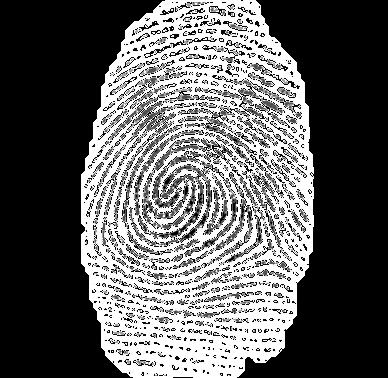

<h2  align = "center" >数字图像处理<br>第一次大作业报告 </h2>

<h6 align = "center">自96 曲世远 2019011455</h6>

### Problem1

#### **1.算法要点与理论原理**

我认为本次作业第一题主要有以下几个要点：

1. 实现指纹图像的前背景分割；
2. 进行脊线方向图及频率图计算；
3. 对脊线进行增强。

为了完成上述要求，我使用了以下方法完成本题：

1. 利用空域频域的方差分析指纹图像区域，再利用图形学方法进一步处理蒙版区域；

2. 首先通过巴特沃斯陷波滤波器对图像进行预处理，再进行直方图均衡后，将图像分大小块进行处理后再对计算结果进行平滑处理；

3. 利用Gabor滤波器使用方向频率图对原图片进行增强。

   

#### 2.算法具体实现

```matlab
%% 计算前背景分割图
function result = ImgMask(img, img_id, mask_size)

[M, N] = size(img);
mask = zeros(M, N); % mask图
mask_M = ceil(M / mask_size);
mask_N = ceil(N / mask_size);
v = zeros(mask_M, mask_N); % 空域方差图
v_ft = zeros(mask_M, mask_N); % 频域方差图
% 求方差
for i = 0: (mask_M - 1)
    for j = 0 : (mask_N - 1) 
        x = fftshift(fft2(img(x0:x1, y0:y1)));
        v(i + 1, j + 1) = std2(img(x0:x1, y0:y1));
        v_ft(i + 1, j + 1) = std2(x);
    end
end
%平滑方差图
v = Smooth(v);
v_ft = Smooth(v_ft);
%归一化
v = (v - v_min) / (v_max - v_min);
v_ft  =(v_ft - v_ft_min) / (v_ft_max - v_ft_min);
%综合时域频域方差计算mask
for i = 0: ceil(M / mask_size) - 1
    for j = 0:ceil(N / mask_size) - 1
        if ((v(i + 1, j + 1) > th_var) && (v_ft(i + 1, j + 1) < th_var_ft))
            mask(x0: x1, y0: y1) = 1;
        end
    end
end
%使用形态学方法优化mask图
% 3先膨胀
if img_id == 3
    s = strel('disk', 10);
    mask =imdilate(mask, s);
end
s = strel('disk', erode);
mask = imerode(mask, s);% 腐蚀
s = strel('disk', dilate);
mask = imdilate(mask, s);% 膨胀
result = mask;
end
```

以上为计算前背景分割图的算法核心部分，首先使用分块计算空域与频域方差的方式获得方差图。再利用平滑后的方差图判断指纹区域。最后利用形态学腐蚀与膨胀的方式获得比较合适的mask图。

```matlab
%% 平滑方向图
function result = Smooth_d(img, img_id)
result = img .* pi ./ 90;
sine = sin(result);
cosine = cos(result); % 分别求正余弦
if img_id == 3
    g_filter = fspecial('gaussian', [24, 24], 1);
else
    g_filter = fspecial('gaussian', [5, 5], 1);
end

sine = imfilter(sine, g_filter, 'replicate', 'same');
cosine = imfilter(cosine, g_filter, 'replicate', 'same'); % 分别光滑滤波
result = atan2(sine, cosine) ./ pi .* 90 + 90; % 转回角度制
end
%% 平滑频率图
function result = Smooth(img)
gf = fspecial('gaussian', [5, 5], 1);
result = imfilter(img, gf, 'replicate', 'same');
end
```

对方向图与频率图的求取在第三次小作业中已经进行了充分的练习，此次作业新增了对于方向和频率图进行平滑的要求。通过高斯滤波器对方向与频率图分别平滑后确实可以极大地改善计算的准确性与绘制效果。

```matlab
%% 对原图进行图像增强
function [result, mask] = Enhance(img, dirc, freq, mask, img_id, sblock, lblock)
[M_, N_] = size(img);
M = ceil(M_ / sblock) * sblock;
N = ceil(N_ / sblock) * sblock;
img = padarray(img, [(M - M_), (N - N_)], 'replicate', 'post');
mask = padarray(mask, [(M - M_), (N - N_)], 'replicate', 'post');
result = zeros(M, N);
mg = zeros(M, N);
ph = zeros(M, N);
for i = 0: ceil(M / sblock) - 1
    for j = 0: ceil(N / sblock) - 1    
        block = img(x0: x1, y0: y1);
        if freq(i + 1, j + 1) > th
            [mg(x0 : x1, y0 : y1), ph(x0: x1, y0 : y1)] = imgaborfilt(block, a / freq(i + 1, j + 1) + b, dirc(i + 1, j + 1));
            block = mg(x0 : x1, y0: y1) .* cos(ph(x0 : x1, y0 : y1));
            % 取中心
            [bm, bn] = size(block);
            result(i * sblock + 1 : i * sblock + sblock, j * sblock + 1 : j * sblock + sblock) = block(ceil((bm - sblock) / 2): ceil((bm - sblock) / 2) + sblock - 1,...
                ceil((bn - sblock) / 2): ceil((bn - sblock) / 2) + sblock - 1); 
            
            % 归一化
            r_max = max(max(result(i * sblock + 1: i * sblock + sblock, j * sblock + 1 : j * sblock + sblock)));
            r_min = min(min(result(i * sblock + 1: i * sblock + sblock, j * sblock + 1 : j * sblock + sblock)));
            result(i * sblock + 1: i * sblock + sblock, j * sblock + 1 : j * sblock + sblock) = ...
                (result(i * sblock + 1: i * sblock + sblock, j * sblock + 1 : j * sblock + sblock) - r_min) / (r_max - r_min);
        else
            result(i * sblock + 1: i * sblock + sblock, j * sblock + 1 : j * sblock + sblock) = 0;
        end
    end
end
% 再次平滑
gf = fspecial('gaussian', [sz, sz], 1);
result = imfilter(result, gf, 'replicate', 'same');
result = imbinarize(result, 0.5);
end
```

本段代码是利用频率与方向图对原图像进行脊线增强的代码。首先使用Gabor滤波器结合频率与方向图，对原图进行增强，再使用高斯滤波器对原图进行空域滤波，改善清晰度。

#### 3.实验结果与分析

##### 首先分析前背景分割的效果：




由上述三组对比可以清晰地看到我使用的分割方法与参数设置可以很好的实现分割指纹与背景噪声的功能，尤其是对于图二的效果也很好可见算法还是具有一定的鲁棒性。

##### 分析陷波滤波结合（局部）直方图均衡对于原图片的处理效果：


##### 对方向与频率图的平滑效果：

##### 对原图进行增强后的效果：

#### 4.遇到的困难与解决方法

本次实验首先遇到的难点是如何设计界面布局以实现多参数可调以及六张图片的显示功能，我在对$Matlab\ app\ designer$进行了仔细研究后，还是决定采用$app\ designer$的选项卡组容器装载不同波形的控件；

之后我还遇到了surf无法显示在界面上的问题，我在查阅了大量的资料后，选择了采用将surf图片加载在坐标图中的方法实现了surf的显示；但之后，我又发现我显示出的surf图片均为纯黑色，并没有分层的彩色显示效果，在经过仔细研究后，我发现是由于$256*256$的图片较大，surf图边界的黑线的密集程度覆盖了色块的颜色，导致surf图片被显示为了纯黑色，为了避免这一现象，我在现实surf图片时采用了取样显示的策略，将需要显示的图片大小采样为$42*42$（除冲激函数之外），这样就实现了较为精确且具有彩色效果的显示结果；

但之后，我又遇到了surf图片显示的另外一个问题，$Matlab\ app\ designer$中的surf对象有很多属性无法具体设置，当坐标轴上的数据间隔很小时，会默认将数值精度显示到小数点后13位，而这样就会导致下图所示的情况：


于是我设计了如下模式将源数据近似到小数点后两位，以避免上图所示的情况。

#### 5.收获

本次作业让我收获了Matlab的gui的编程方法，熟练掌握了Matlabapp的编程方法；同时也通过自行编写程序实验并观察的方式更加清晰地掌握了DFT的原理与性质特征，在推导DFT的过程中更是对于矩阵运算有了更深刻的理解。同时也在使用app的过程中提高了研究问题并解决问题的能力，也在设计这样一个并不算小的工程中，学习了一些管理全局变量以及封装函数的经验。

#### 6.可能的改进方向

我认为我本次作业的完成质量还是比较可观的，有以下几个方面由于时间与能力的不足，我认为后续还可以加以提高：

1. 由于surf在app中的属性有限，不能自定义坐标轴属性，如果后续可以改善的话可以尝试用其他工具或是控件实现该功能，以避免需要设计精确与模糊模式。
2. 由于本次题目要求实现一个DFT函数，因此我没有为了进一步提高速度而简化DFT计算部分的功能而是将其封装成了一个独立的函数，如果为了提高计算速度可以在一些固定大小的基础计算矩阵的生成上进一步提高速度。

#### 7.参考文献

无

### Problem2

#### **1.算法要点与理论原理**

通过利用指纹图像的傅里叶变换结果，找到指纹脊线的方向，并绘制在原图片上。

#### 2.算法具体实现

首先找到小块附近的大块边界点坐标，注意特殊判断边界条件。

```matlab
for i = 0 : ceil(X / sblock) - 1
    for j = 0 : ceil(Y / sblock) - 1
        % 计算以小块为中心的大块的边际点坐标+特判
        x0 = ((i * sblock - (lblock - sblock) / 2) < 1) + ((i * sblock - (lblock - sblock) / 2) >= 1) * (i * sblock - (lblock - sblock) / 2); 
        y0 = ((j * sblock - (lblock - sblock) / 2) < 1) + ((j * sblock - (lblock - sblock) / 2) >= 1) * (j * sblock - (lblock - sblock) / 2); 
        x1 = ((i * sblock + (lblock - sblock) / 2 + sblock - 1) > X) * X + ((i * sblock + 23) <= X) * (i * sblock + (lblock - sblock) / 2 + sblock - 1); 
        y1 = ((j * sblock + (lblock - sblock) / 2 + sblock - 1) > Y) * Y + ((j * sblock + 23) <= Y) * (j * sblock + (lblock - sblock) / 2 + sblock - 1); 
        block_l = Image(x0: x1, y0: y1);
```

之后对得到的大块数据进行处理及傅里叶变换，因为傅里叶变换的结果会包含常量，因此可以先在空域对图像做减去平均值的预处理。同时，注意到待处理的图像有很多的留白区域不需要进行分析处理，可以在该部分将这些块跳过。

```matlab
block_l = block_l - mean(mean(block_l));
if mean(mean(block_l)) <= 3
	ROI(i + 1, j + 1) = 0;
	Period(i + 1, j + 1) = 0;
	continue;
end
%imshow(block_l)

block_l = abs(fftshift(fft2(block_l)));
```

之后分析该块内的指纹脊线方向，通过课上学习到的知识与课外查询的资料知道傅里叶变换得到的两个最大值方向就是脊线的方向，而由于该值应当成对出现，故可以直接取最大的两个值进行角度与周期计算。

```matlab
while 1
	[x, y] = find(block_l == max(max(block_l)));
	if length(x) > 1
		break;
	else 
	block_l(x, y) = 0;
	end
end
ROI(i + 1, j + 1) = 1;
Direction(i + 1, j + 1) = atand((y(1) - y(2)) / (x(1) - x(2)));
Period(i + 1, j + 1) = 1 / sqrt((y(1) - y(2))^2 + (x(1) - x(2)) ^ 2);
```

同时以上的部分也可以采用排序后结果进行计算（未在最终代码中采用，但效果也可以）

```matalb
[block_sorted, index] = sort(block_l(:), 'descend');
[u, v] = ind2sub(size(block_l), index(1));
[m, n] = ind2sub(size(block_l), index(2));
if u == m && v == n
	Direction(i + 1, j + 1) = 0;
	Period(i + 1, j + 1) = 0;
	ROI(i + 1, j + 1) = 0;
else
	ROI(i + 1, j + 1) = 1;
	Direction(i + 1, j + 1) = atand((n - v) / (m - u));
	Period(i + 1, j + 1) = 4 / sqrt((n - v) ^ 2 + (m - u) ^ 2);
end
```

之后为了更好的显示结果，通过老师提供的显示函数指定一些参数，并对周期图进行拉伸显示处理，代码如下：

```matlab
DrawDir(1, Direction, sblock, 'b', ROI);
Period = uint8(255 / max(max(Period)) * Period); %映射到0-255
figure(2),imshow(Period, 'InitialMagnification', 'fit');
```

#### 3.实验结果与分析


由上述两图可知，本代码较好地完成了题目要求绘制出了题目要求的周期图像与脊线方向，只有一些边缘位置的结果由于图像的边缘有噪声的干扰出现了一些问题，但并不影响整体结果。

#### 4.遇到的困难与解决方法

首先遇到的困难就是我在此之前并不是很清楚傅里叶变换在指纹识别中的作用与应用方式，在经过老师的介绍与和同学们的讨论之后，我才逐渐明白了工作原理与应用方式。在之后的调试过程中，由于已经多次应用matlab处理图像，我在完成本题的调试过程中还是比较顺利的，只是通过几次的输出图像与查看源数据的方式就解决了遇到的小问题。

#### 5.收获

通过本次实验，我对傅里叶变化的性质与应用有了更清晰的认识，也掌握了傅里叶变换处理图像的一般方法与一些小技巧。

#### 6.可能的改进方向

可以针对现在结果的边界问题加以改进算法，比如可以考虑使用一些数值分析的技巧平整边界的噪声并且使用插值法处理数据，使得结果更加准确美观。

