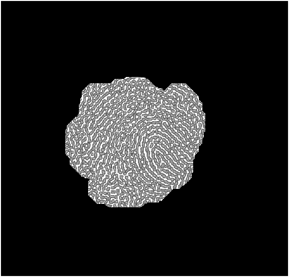

<h2  align = "center" >数字图像处理<br>第一次大作业报告 </h2>

<h6 align = "center">自96 曲世远 2019011455</h6>

### Problem1

#### 0.代码使用方式

只需要修改`image_id`的参数就可以实现三张图片的切换，无需修改其他代码。

会分别将mask图片，预处理后的mask图片，频域的方向频率图，平滑后的方向频率图以及最终增强图片显示出来，并保存最终增强后的图片。

#### **1.算法要点与理论原理**

我认为本次作业第一题主要有以下几个要点：

1. 实现指纹图像的前背景分割；
2. 进行脊线方向图及频率图计算；
3. 对脊线进行增强。

为了完成上述要求，我使用了以下方法完成本题：

1. 利用**空域频域的方差**分析指纹图像区域，再利用**形态学**方法进一步处理蒙版区域；

2. 首先通过**巴特沃斯陷波滤波器**对图像进行预处理，再进行**直方图均衡**后，将图像分大小块进行处理后再对计算频域的频率与方向进行平滑处理；

3. 利用**Gabor滤波器**使用方向频率图对原图片进行增强再结合**高斯滤波**提高清晰度。

   

#### 2.算法具体实现

```matlab
%% 计算前背景分割图
function result = ImgMask(img, img_id, mask_size)

[M, N] = size(img);
mask = zeros(M, N); % mask图
mask_M = ceil(M / mask_size);
mask_N = ceil(N / mask_size);
v = zeros(mask_M, mask_N); % 空域方差图
v_ft = zeros(mask_M, mask_N); % 频域方差图
% 求方差
for i = 0: (mask_M - 1)
    for j = 0 : (mask_N - 1) 
        x = fftshift(fft2(img(x0:x1, y0:y1)));
        v(i + 1, j + 1) = std2(img(x0:x1, y0:y1));
        v_ft(i + 1, j + 1) = std2(x);
    end
end
%平滑方差图
v = Smooth(v);
v_ft = Smooth(v_ft);
%归一化
v = (v - v_min) / (v_max - v_min);
v_ft  =(v_ft - v_ft_min) / (v_ft_max - v_ft_min);
%综合时域频域方差计算mask
for i = 0: ceil(M / mask_size) - 1
    for j = 0:ceil(N / mask_size) - 1
        if ((v(i + 1, j + 1) > th_var) && (v_ft(i + 1, j + 1) < th_var_ft))
            mask(x0: x1, y0: y1) = 1;
        end
    end
end
%使用形态学方法优化mask图
% 3先膨胀
if img_id == 3
    s = strel('disk', 10);
    mask =imdilate(mask, s);
end
s = strel('disk', erode);
mask = imerode(mask, s);% 腐蚀
s = strel('disk', dilate);
mask = imdilate(mask, s);% 膨胀
result = mask;
end
```

以上为计算前背景分割图的算法核心部分，首先使用分块计算空域与频域方差的方式获得方差图。再利用平滑后的方差图判断指纹区域。最后利用形态学腐蚀与膨胀的方式获得比较合适的mask图。

```matlab
%% 平滑方向图
function result = Smooth_d(img, img_id)
result = img .* pi ./ 90;
sine = sin(result);
cosine = cos(result); % 分别求正余弦
if img_id == 3
    g_filter = fspecial('gaussian', [24, 24], 1);
else
    g_filter = fspecial('gaussian', [5, 5], 1);
end

sine = imfilter(sine, g_filter, 'replicate', 'same');
cosine = imfilter(cosine, g_filter, 'replicate', 'same'); % 分别光滑滤波
result = atan2(sine, cosine) ./ pi .* 90 + 90; % 转回角度制
end
%% 平滑频率图
function result = Smooth(img)
gf = fspecial('gaussian', [5, 5], 1);
result = imfilter(img, gf, 'replicate', 'same');
end
```

对方向图与频率图的求取在第三次小作业中已经进行了充分的练习，此次作业新增了对于方向和频率图进行平滑的要求。通过高斯滤波器对方向与频率图分别平滑后确实可以极大地改善计算的准确性与绘制效果。

```matlab
%% 对原图进行图像增强
function [result, mask] = Enhance(img, dirc, freq, mask, img_id, sblock, lblock)
[M_, N_] = size(img);
M = ceil(M_ / sblock) * sblock;
N = ceil(N_ / sblock) * sblock;
img = padarray(img, [(M - M_), (N - N_)], 'replicate', 'post');
mask = padarray(mask, [(M - M_), (N - N_)], 'replicate', 'post');
result = zeros(M, N);
mg = zeros(M, N);
ph = zeros(M, N);
for i = 0: ceil(M / sblock) - 1
    for j = 0: ceil(N / sblock) - 1    
        block = img(x0: x1, y0: y1);
        if freq(i + 1, j + 1) > th
            [mg(x0 : x1, y0 : y1), ph(x0: x1, y0 : y1)] = imgaborfilt(block, a / freq(i + 1, j + 1) + b, dirc(i + 1, j + 1));
            block = mg(x0 : x1, y0: y1) .* cos(ph(x0 : x1, y0 : y1));
            % 取中心
            [bm, bn] = size(block);
            result(i * sblock + 1 : i * sblock + sblock, j * sblock + 1 : j * sblock + sblock) = block(ceil((bm - sblock) / 2): ceil((bm - sblock) / 2) + sblock - 1,...
                ceil((bn - sblock) / 2): ceil((bn - sblock) / 2) + sblock - 1); 
            
            % 归一化
            r_max = max(max(result(i * sblock + 1: i * sblock + sblock, j * sblock + 1 : j * sblock + sblock)));
            r_min = min(min(result(i * sblock + 1: i * sblock + sblock, j * sblock + 1 : j * sblock + sblock)));
            result(i * sblock + 1: i * sblock + sblock, j * sblock + 1 : j * sblock + sblock) = ...
                (result(i * sblock + 1: i * sblock + sblock, j * sblock + 1 : j * sblock + sblock) - r_min) / (r_max - r_min);
        else
            result(i * sblock + 1: i * sblock + sblock, j * sblock + 1 : j * sblock + sblock) = 0;
        end
    end
end
% 再次平滑
gf = fspecial('gaussian', [sz, sz], 1);
result = imfilter(result, gf, 'replicate', 'same');
result = imbinarize(result, 0.5);
end
```

本段代码是利用频率与方向图对原图像进行脊线增强的代码。首先使用Gabor滤波器结合频率与方向图，对原图进行增强，再使用高斯滤波器对原图进行空域滤波，改善清晰度。

#### 3.实验结果与分析

##### 首先分析前背景分割的效果：


由上述三组对比可以清晰地看到我使用的分割方法与参数设置可以很好的实现分割指纹与背景噪声的功能，尤其是对于图二的效果也很好可见算法还是具有一定的鲁棒性。

##### 分析陷波滤波结合（局部）直方图均衡对于原图片的处理效果：



可以看到，对于图二这种背景噪声最为明显的图片来说，利用陷波滤波与局部直方图均衡的方式可以很好的提取有效的指图案。

##### 对方向与频率图的平滑效果（以图1为例）：


由上述四张图片的对比可以看到通过对于方向与频率图的平滑，可以实现对于频率方向很好的平滑效果，有效的处理了图像上的一些由于噪声带来的干扰点，实现了更好的增强效果。（图片显示使用了归一化的显示方式）

##### 对原图进行增强后的效果：


由上述对比可知，我的算法对于指纹图像的分割与增强都可以很好的实现，并且对于原图比较复杂与噪声较多的情况也可以较好的处理，但是对于掌纹这种纹路来说，处理的情况就不是那么的理想。我认为是由于掌纹存在过多的交叉脊线与细小格纹导致了分块的方向与频率图不完全正确，很难通过与指纹相类似的脊线增强达到很好的效果。不过我对于掌纹的增强也实现了对于主要掌纹线的走向判断。

#### 4.遇到的困难与解决方法

首先遇到的问题就是应该如何组织各种方法的使用。通过老师上课的讲解，我初步掌握了各种滤波器的使用方式以及作用，以及平滑、方差等的图像处理手段。但如何对这些手段进行有机结合并且很好的使其起到最好的作用也是需要统筹规划的。我在反复研读了老师的PPT之后，并且结合老师作业文档中的各种提示，设计了上述的处理方式。并且通过逐步试错（可在代码的注释中发现各种尝试的痕迹）达到了当前实现的比较好的效果。

其次是在进行各种小块处理时的越界与对齐问题。对于图像坐标的详细处理一直是比较容易出现问题的位置。为了便于后续调试代码，我在进行计算时全部采用的是变量运算而非常数定义，因此各种公式异常复杂，当具有很强的可移植性与适用性。因此我的所有函数都可以通过实参进行调整工作过程。

最后以及最重要的还是调整各项参数。我的代码中存在一些`switch`语句，就是针对不同的图片设置各种参数，以使得算法能够更好的处理不同类型的图像。通过反复尝试与总结规律，我当前采用的参数是对于我的算法比较优秀的。

#### 5.收获

本次作业主要让我收获了对于指纹图像增强的方法。尤其是在这一过程中运用了大量空域与频域滤波的方式以及利用图像的方差，频域方向/频率等等属性。进一步清晰的认识图像处理的手段以及图像各种属性对于图像不同方面的影响以及改善方法。

#### 6.可能的改进方向

我认为我本次大作业仍旧存在一些可以的改进方向，主要集中在以下方面：

1. 对于指纹图像的脊线增强，我认为我时显得较为不错，如果可以，我希望能够通过一些算法分析图像的特征从而自动指定一些滤波器的参数。这样就可以实现针对不同图片算法自动调整参数，实现全自动的图像增强。
2. 目前我的算法很好的适合于指纹图像的处理，但是对于掌纹来说却并不是那么理想，也许可以进行一些改进的尝试一遍能够处理好掌纹图像的增强。

#### 7.参考文献

Lin Hong, Yifei Wan, and Anil K. Jain. "Fingerprint image enhancement: Algorithm and performance evaluation." *IEEE Transactions on Pattern Analysis and Machine Intelligence* 20.8 (1998): 777-789.

