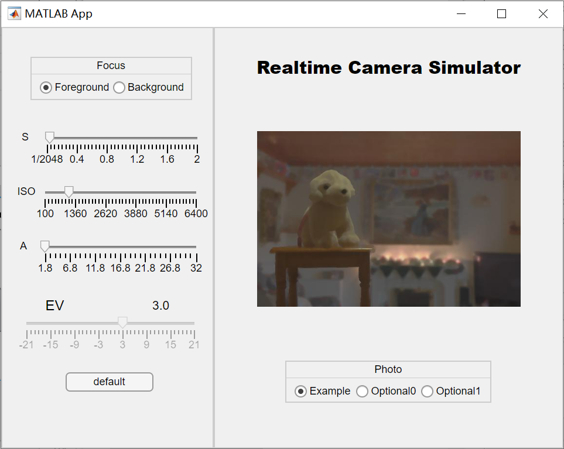
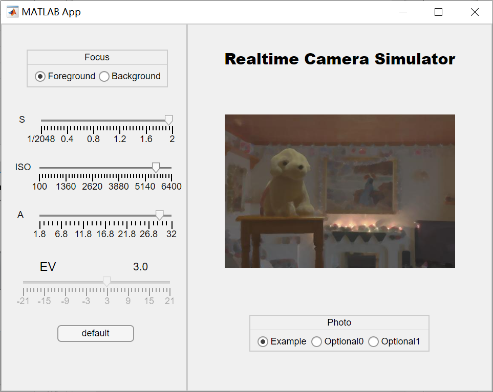
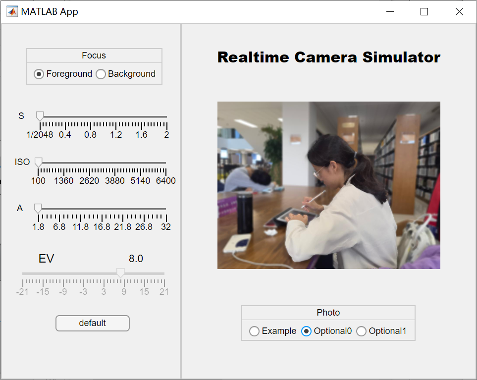

<h2  align = "center" >数字图像处理<br>第二次小作业报告 </h2>

<h6 align = "center">自96 曲世远 2019011455</h6>

#### **1.算法要点与理论原理**

本次作业要求实现一个模拟照相机的ui界面，及调整ISO，S，A三个参数时，对照片做出相应调整与处理，并实现其他的小功能。

本次作业主要的算法部分在与调整光圈大小以及对焦位置时，通过均值滤波对非对焦部分进行不同程度的模糊处理以及通过EV值的公式对照片的亮度进行调节。

算法的难点<u>**1.**</u>在于针对不同的照片及对焦位置以及参数A调整滤波器的大小进而控制模糊程度<u>**2.**</u>在于进行前后景图像合并时避免出现边缘处的黑边与不平滑现象。

1. 针对动态调整滤波器的大小的问题，我使用了一个拟合函数，考虑到了图像的大小以及参数A的值来控制滤波器的大小。公式如下：
   $$
   filter\_size = \lceil (\log_{e^2}{\sqrt{\frac{image\_size}{150000}}} + 1) \times \frac{33 - A}{2.4} \rceil
   $$

2. 前后景合并时出现黑边的原因是因为在读取PNG图片时，如果不采用RGB与Alpha通道同时读取的方式，Matlab会将PNG图片的Alpha通道的信息合并到RGB通道并将透明部分记为黑色；但如果同时读取Alpha通道与RGB通道，就可以在RGB通道获取到PNG图像中透明度为0部分的原图信息，从而在滤波的过程中可以保证前景照片更加的平滑，也避免了前景图像与边缘的黑色在滤波后的混杂从而导致的黑边现象。

#### 2.算法具体实现

```matlab
%生成滤波器大小
filter_size = ceil((log(sqrt(image_size(1) .* image_size(2) ./ 500 ./ 300) ./ 2 + 1)) .*(33 - app.A) ./ 2.4);
%归一化Alpha通道数值
alpha = double(alpha ./ 255);
```

首先预处理必需的数据获得滤波器的大小与归一化后的Alpha通道矩阵值。

```matlab
%分焦点情况模糊处理图像并合并前后景图像
if app.focussel == "Foreground"
    %filter the background
    background = imfilter(background, 				                     fspecial("average", filter_size), 'replicate');
    %cat the back and fore
    se = strel('disk',4);
    image_processed = background.*uint8(~forescope) + foreground;
    image_processed = imclose(image_processed,se);
else 
    %filter the background
    foreground = imfilter(foreground_full,                               fspecial("average", filter_size), 'replicate');
    %cat the back and fore
    se = strel('disk',4);
    image_processed = background.*uint8(1 - alpha) + foreground .* uint8(alpha);
     image_processed = imclose(image_processed,se);
end
```

本段代码是图片处理过程中的核心代码，主要是针对焦点位于前景或是后景的不同情况进行图像模糊，并根据Alpha通道数值进行合并图像。再通过图形学闭运算平滑拼接图像的边界位置。

```matlab
%deltaPIX
    deltap = deltaPIX(app);
    image_processed = image_processed + deltap;
    app.Image.ImageSource = image_processed;
```

本段代码主要使用已知的公式，根据现有的相机参数调整图片的亮度。

```matlab
background = imread(background_path);
foreground = imread(foreground_path);
[foreground_full, ~, alpha] = imread(foreground_path);
```

为了解决第一部分提到的第二个问题，我才用了两种方式读入图像，分别得到我希望得到的数据与图片矩阵格式。就很好地解决了拼接图像时，由于空域滤波带来的黑边问题。


#### 3.实验结果与分析



由上两图可知，在选择不同焦点时，可以看出对焦带来的前、背景模糊效果，并且拼接的图像边缘没有明显黑边与缝隙。



可以看到，在调整A并保持EV值相同后，可以与上左图比较发现明显景深提高了。，下面用自己的一组照片做与上述类似的对比。




上述两组三张图片的横向对比也可以发现，我拟合的滤波器大小函数，可以在两种不同大小($540\times360 / 1080 \times 768$)的图片上，均得到很好的效果，并且合成的效果也均很好。

#### 4.遇到的困难与解决方法

本次实验遇到的最大困难就是第一部分提到的第一个难点，即合成图片后的黑边问题。在仔细观察了现象之后，我分析认为产生黑边的原因就是由于进行空域滤波后，边缘图像值与0进行了均值处理后造成的。在搜索了Matlab滤波器函数后，我发现了Matlab的imfilter函数可以使用 'replicate'参数，既可以扩展边界值，避免上述问题。

但我在尝试使用了上述函数之后，问题并没有得到解决，仔细思考了该函数的工作机理与我的图像矩阵输入后，我发现我所需要的前景图像边缘并不是滤波器得到的前景图像边缘。于是我自私的思考并观察了PNG图像进行imread后的矩阵数据，通过多种方法的实验与观察，我分析出了imread的两种读取PNG图像矩阵的结果是不同的。正如上文所述，在读取Alpha通道时，RGB通道的返回值是全面的原图，因此就可以利用原图信息得到边缘平顺的前景图片，之后进行图像合成。

#### 5.收获

本次作业让我收获了Matlab的gui的编程方法，熟练掌握了Matlabapp的编程方法；同时我也熟练掌握了图片空域滤波的方法以及亮度的调节方法，对照片的三个参数有了更好的认识；同时，通过自己独立的解决了滤波后合成图像的黑边问题，我不仅帮助了很多其他同学解决同一问题，还提高了自己观察与分析解决问题的能力，极大的提高编程与解决问题的能力。

#### 6.可能的改进方向

我认为我本次作业的完成质量还是比较可观的，有以下几个方面由于时间与能力的不足，我认为后续还可以加以提高：

1. 滤波器大小的拟合函数过于经验化，没有合适的理论依据与统一模型，后续可以进行理论分析得到更为合适的拟合公式
2. app编写的某些功能还是不够智能，可以进一步提高以完善用户体验。

#### 7.参考文献

无
