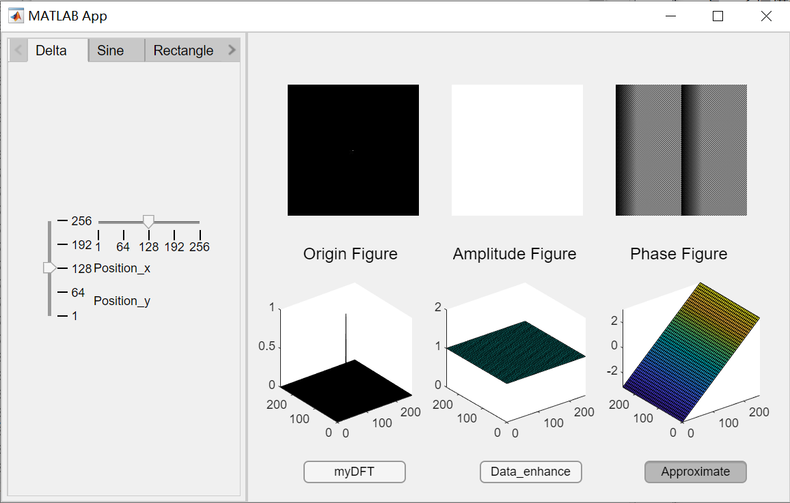
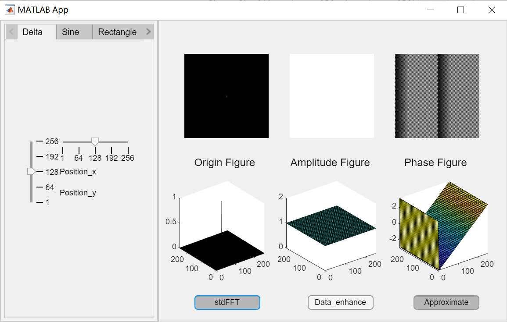
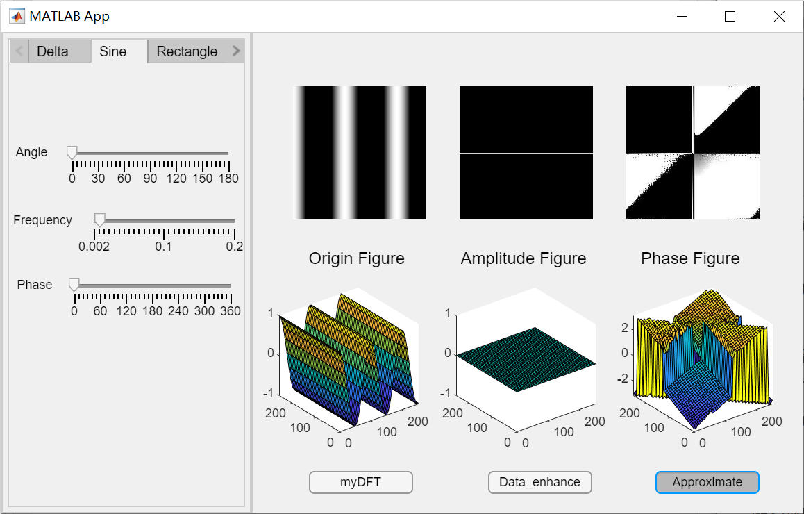
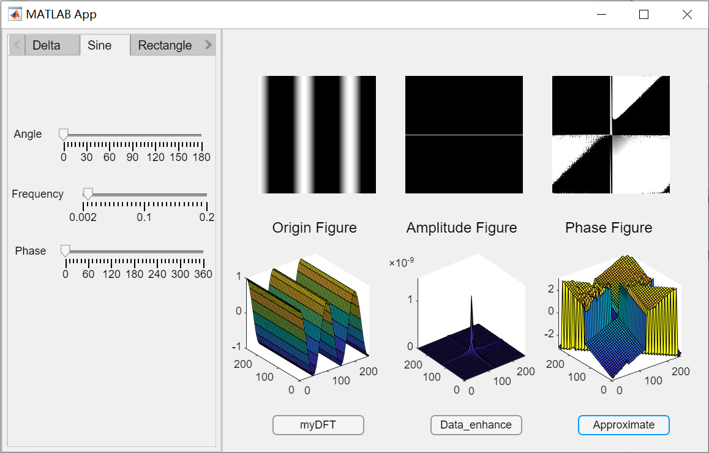
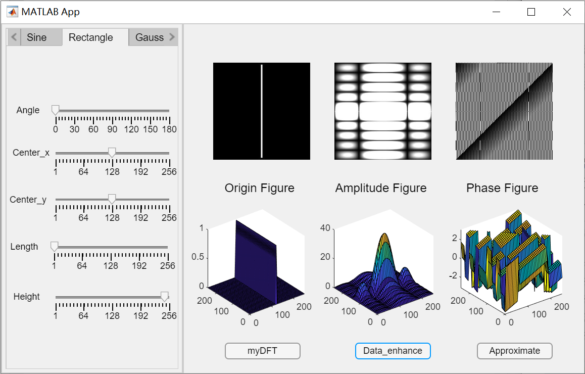
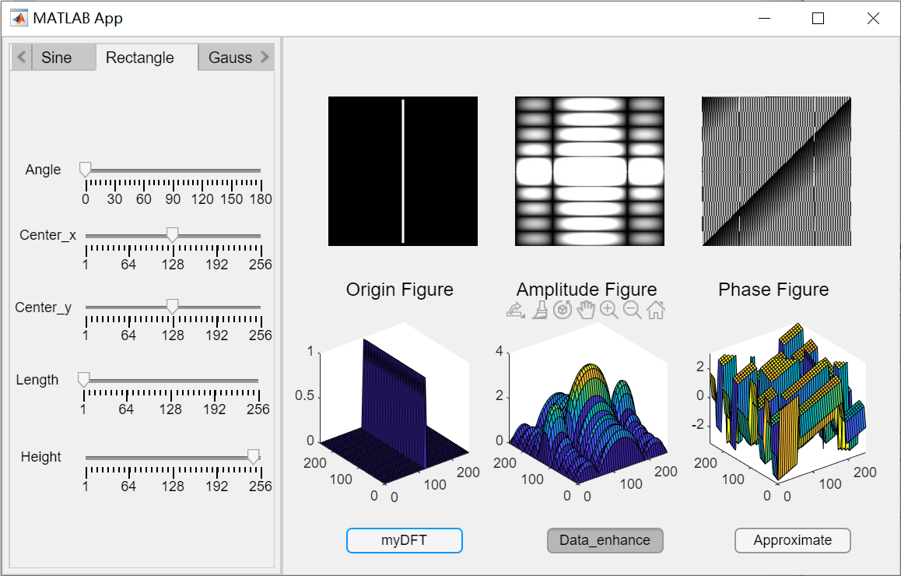
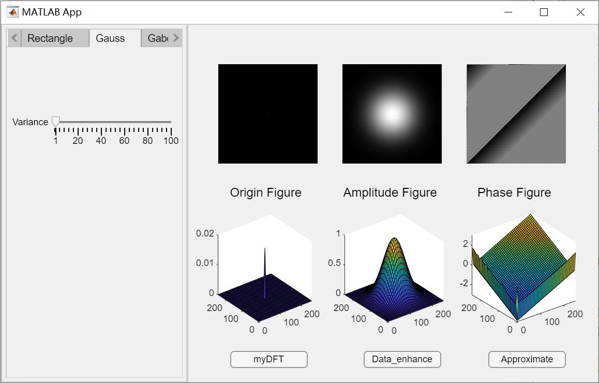
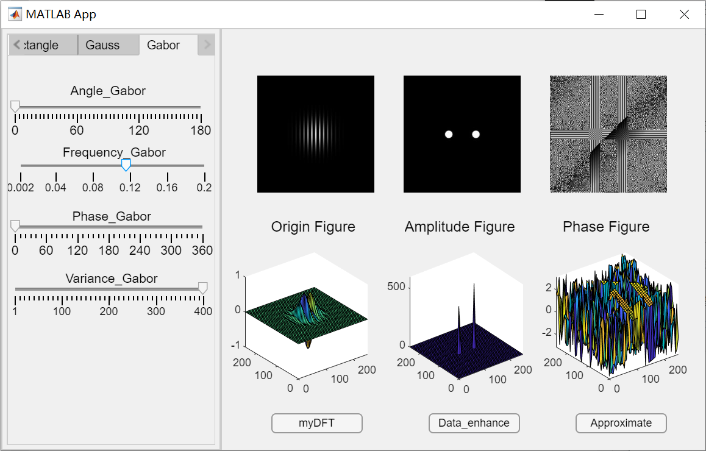
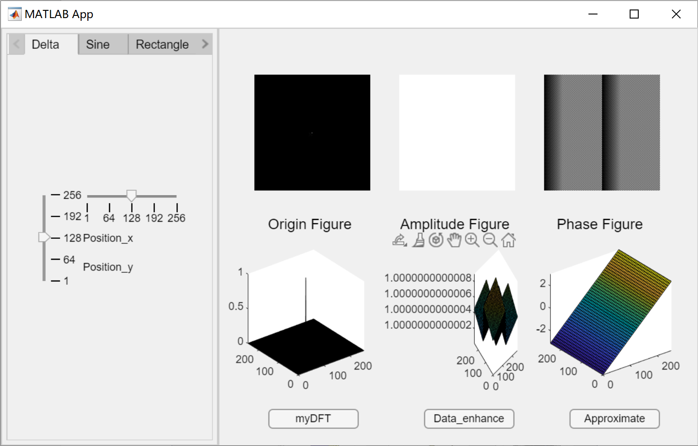

<h2  align = "center" >数字图像处理<br>第二次小作业报告 </h2>

<h6 align = "center">自96 曲世远 2019011455</h6>

### Problem1

#### **1.算法要点与理论原理**

我认为本次作业第一题主要有以下几个要点：

1. 首先需要生成满足题目要求的二位波形图形，并且可以依据参数进行调节；
2. 针对题目要求的五种波形需要设计出对应于波形的参数调整UI界面；
3. 实现DFT运算函数并且保证运算速度；
4. 实现较为美观且准确的结果显示

针对以上我认为以及实现过程中遇到的算法要点，我才用了以下的算法原理加以解决：

1. 将波形产生函数进行整合，并基于$Wavetype$变量进行波形发生；
2. 由于如果采用但界面+隐藏UI设计会导致很大的重复代码量且不利于调整界面设计以及不够直观；因此我使用了$Matlab\ app\ designer$中的选项卡组容器，容纳不同波形选项时的参数调整组件。
3. 实现了基于矩阵的DFT运算函数以提高运算速度并且保证正确性，同时我引入了系统内置的FFT函数可以进行两种变换的比较，以验证正确性。
4. 由于surf并不能直接显示在$Matlab\ app\ designer$上，因此需要通过坐标图，并将surf加载到坐标图上。但由于$Matlab\ app\ designer$中的坐标图组件参数过少，并不能指定坐标轴的刻度显示精度，因此我设计了精确显示模式（可能会因为小数点后位数过多导致显示不美观）与非精确显示模式。

#### 2.算法具体实现

```matlab
%% generate origin figure 
function Wave_generate(app)
	fig = zeros(256, 256);
    fig_1 = zeros(256, 256); %#ok<PREALL> 
    fig_2 = zeros(256, 256); %#ok<PREALL> 
	[X, Y] = meshgrid(1: 256);
	switch app.Wavetype
	case "Delta"
		fig(257 - app.position_y, app.position_x) = 1;
	case "Sine"
		an = app.angle_sin .* pi ./ 180;
		ph = app.phase .* pi ./ 180;
		fig = cos(2 .* pi .* app.frequency .* (cos(an) .* X + sin(an) .* Y) + ph);
	case "Rectangle"
		% have to edit the logic of rotate
		y_min = ceil(app.center_x - app.length ./ 2);
		y_max = ceil(app.center_x + app.length ./ 2);
		x_min = ceil(app.center_y - app.width ./ 2);
		x_max = ceil(app.center_y + app.width ./ 2);
		x_min = app.mapping1_256(x_min);
		x_max = app.mapping1_256(x_max);
		y_min = app.mapping1_256(y_min);
		y_max = app.mapping1_256(y_max);
		fig(x_min : x_max, y_min: y_max) = 1;
		fig = imrotate(fig, app.angle_rec, "bilinear", "crop");
	case "Gauss"
		fig = (X - 128.5) .^ 2 + (Y - 128.5) .^ 2;
		fig = exp(- fig ./ (2 .* app.variance)) ./ (2 .* pi .* 		app.variance);
	case "Gabor"
        an = app.angle_gabor .* pi ./ 180;
        ph = app.phase_gabor .* pi ./ 180;
        fig_1 = cos(2 .* pi .* app.frequency_gabor .* (cos(an) .* X + sin(an) .* Y) + ph);
        fig_2 = (X - 128.5) .^ 2 + (Y - 128.5) .^ 2;
        fig_2 = exp(- fig_2 ./ (2 .* app.variance_gabor)) ./ (2 .* pi .* app.variance_gabor);
        fig = fig_1 .* fig_2;
	end
	app.Origin_fig_2 = fig;
end
```

首先通过不同波形的生成函数生成二维波形图像$app.Origin\_fig\_2$。

```matlab
%% generate the DFT figure
function Ffigure = DFT_2(~, figure)
    [M, N] = size(figure);
    ux = (0 : M - 1)' * (0 : M - 1);
    vy = (0 : N - 1)' * (0 : N - 1);
    eMUX = exp(-2 * pi * 1i / M) .^ ux;
    eNVY = exp(-2 * pi * 1i / N) .^ vy;
    figure = figure + 0i;
    Ffigure = eMUX * figure * eNVY;
end
```

本段代码是进行DFT变换的核心代码，实现了一个对于二维$figure$图像的DFT变换。具体实现逻辑为先将$e^{-j2\pi (ux/M + vy / N)}$转化为$eMUX*eNVY$，而$eMUX, eNVY$的生成过程也是通过向量运算与矩阵运算实现的，因此整个运算过程速度可以得到保证。之后利用$eMUX * figure * eNVY$的公式就可以计算得到$figure$的DFT变换结果。

```matlab
%% show the 3D surf
function show_3D(app)
    step = 6;% to present better
    [X, Y] = meshgrid(1 : 256, 1 : 256);
    [X_step, Y_step] = meshgrid(1: step: 256, 1 : step : 256);
    switch app.Wavetype
    case "Delta"
        surf(app.Axes_origin, X, Y, app.Origin_fig_2);
        surf(app.Axes_ampli, X_step, Y_step, app.Amplitude_fig_2(1 : step : 256, 1 : step : 256));
        surf(app.Axes_phase, X_step, Y_step, app.Phase_fig_2(1 : step : 256, 1 : step : 256));
    case {"Sine", "Rectangle", "Gauss", "Gabor"}
        surf(app.Axes_origin, X_step, Y_step, ...
        app.Origin_fig_2(1 : step : 256, 1 : step : 256));
        surf(app.Axes_ampli, X_step, Y_step, ...
        app.Amplitude_fig_2(1 : step : 256, 1 : step : 256));
        surf(app.Axes_phase, X_step, Y_step, ...
        app.Phase_fig_2(1 : step : 256, 1 : step : 256));
    end
end
%function to show the 6 figure
function fig_show(app)
    app.Wave_generate();
    if app.myDFTButton.Text == "myDFT"
    	DFT_origin = app.DFT_shift(app.DFT_2(app.Origin_fig_2));
    elseif app.myDFTButton.Text == "stdFFT"
    	DFT_origin = fftshift(fft2(double(app.Origin_fig_2)));
    end
    app.Amplitude_fig_2 = abs(DFT_origin);
    if app.Data_enhanceButton.Value == true
    	app.Amplitude_fig_2 = log(app.Amplitude_fig_2 + 1);
    end
    if app.ApproximateButton.Value == true
    	app.Amplitude_fig_2 = round(app.Amplitude_fig_2, 2);
    end
    app.Phase_fig_2 = angle(DFT_origin);
    app.Image_origin_2.ImageSource = cat(3, app.Origin_fig_2, app.Origin_fig_2, app.Origin_fig_2); 
    app.Image_ampli_2.ImageSource = cat(3, app.Amplitude_fig_2, app.Amplitude_fig_2, app.Amplitude_fig_2);
    app.Image_phase_2.ImageSource = cat(3, app.Phase_fig_2, app.Phase_fig_2, app.Phase_fig_2); 
    app.show_3D();
end
```

本段代码主要是利用生成的波形图像以及DFT函数将计算得到的DFT图像并通过surf显示在坐标图中并将原图显示在图片位置，本段代码主要是为了实现“与标准FFT比较”， “对DFT结果进行数据增强”， “进行模糊/准确显示”三个功能进行了$if-else$判断。

另外就是为了使得surf图显示的图像足够颜色清晰，我对于DFT的显示结果采用了显示采样的方式，以避免surf在显示的过程中由于边界线的黑色覆盖了图像的彩色。

#### 3.实验结果与分析



上述两张图片显示波形在为脉冲函数时的结果。可以看到本界面能够较好的实现要求的所有功能，并且DFt与FFT的结果基本一致，也验证了正确性。



上述两张图片为显示波形在为三角函数时的结果。显示了在精确/模糊模式下DFT变换幅度谱的就显示结果差异，由于做了模糊近似，导致三角函数的DFT幅度谱结果为0，而在精确模式下却可以观察到明确的峰点出现。这也是我设计了这两种模式的初衷。



上述两张图片显示了波形在为矩形波的时候的结果。可以看见在进行数据增强后，DFT变换的幅度谱结果有着明显的变化，可以更加清晰的观察到矩形波变化的结果特征。因此我设计了是否进行数据增强这一选项。对DFT变换结果的数据增强算法依据下述公式：
$$
Amplitude\_fig\_2 = log(Amplitude\_fig\_2 + 1);
$$


上述两张图片分别显示了在典型$Gauss, Gabor$信号下的DFT结果。

#### 4.遇到的困难与解决方法

本次实验首先遇到的难点是如何设计界面布局以实现多参数可调以及六张图片的显示功能，我在对$Matlab\ app\ designer$进行了仔细研究后，还是决定采用$app\ designer$的选项卡组容器装载不同波形的控件；

之后我还遇到了surf无法显示在界面上的问题，我在查阅了大量的资料后，选择了采用将surf图片加载在坐标图中的方法实现了surf的显示；但之后，我又发现我显示出的surf图片均为纯黑色，并没有分层的彩色显示效果，在经过仔细研究后，我发现是由于$256*256$的图片较大，surf图边界的黑线的密集程度覆盖了色块的颜色，导致surf图片被显示为了纯黑色，为了避免这一现象，我在现实surf图片时采用了取样显示的策略，将需要显示的图片大小采样为$42*42$（除冲激函数之外），这样就实现了较为精确且具有彩色效果的显示结果；

但之后，我又遇到了surf图片显示的另外一个问题，$Matlab\ app\ designer$中的surf对象有很多属性无法具体设置，当坐标轴上的数据间隔很小时，会默认将数值精度显示到小数点后13位，而这样就会导致下图所示的情况：



于是我设计了如下模式将源数据近似到小数点后两位，以避免上图所示的情况。

#### 5.收获

本次作业让我收获了Matlab的gui的编程方法，熟练掌握了Matlabapp的编程方法；同时也通过自行编写程序实验并观察的方式更加清晰地掌握了DFT的原理与性质特征，在推导DFT的过程中更是对于矩阵运算有了更深刻的理解。同时也在使用app的过程中提高了研究问题并解决问题的能力，也在设计这样一个并不算小的工程中，学习了一些管理全局变量以及封装函数的经验。

#### 6.可能的改进方向

我认为我本次作业的完成质量还是比较可观的，有以下几个方面由于时间与能力的不足，我认为后续还可以加以提高：

1. 由于surf在app中的属性有限，不能自定义坐标轴属性，如果后续可以改善的话可以尝试用其他工具或是控件实现该功能，以避免需要设计精确与模糊模式。
2. 由于本次题目要求实现一个DFT函数，因此我没有为了进一步提高速度而简化DFT计算部分的功能而是将其封装成了一个独立的函数，如果为了提高计算速度可以在一些固定大小的基础计算矩阵的生成上进一步提高速度。

#### 7.参考文献

无

### Problem2

