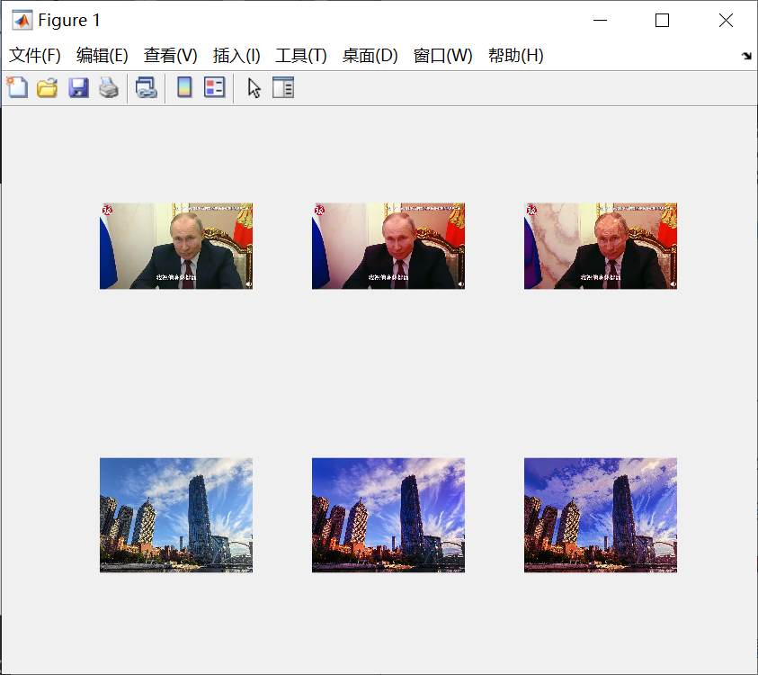
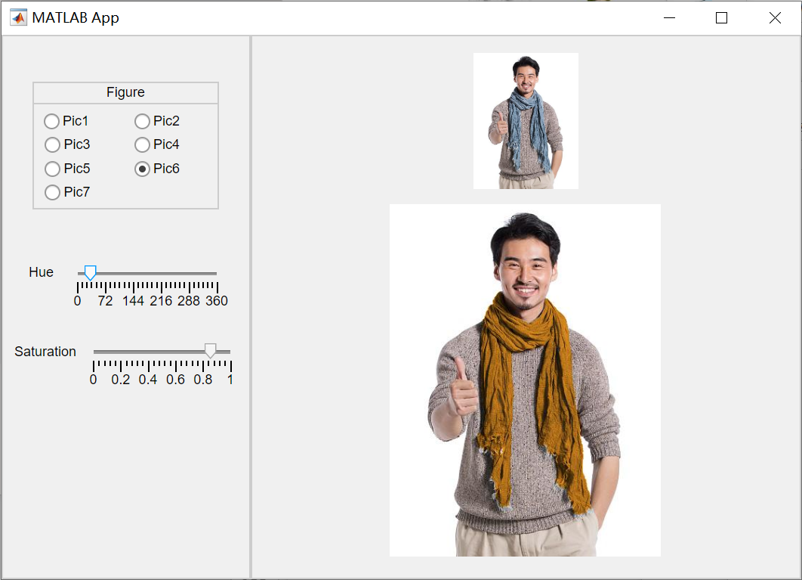

<h2  align = "center" >数字图像处理<br>第四次小作业报告 </h2>

<h6 align = "center">自96 曲世远 2019011455</h6>

### Problem1

#### **1.算法要点与理论原理**

我认为本次作业第一题主要有以下几个要点：

1. 将LUT图像生成并进行合适的坐标变换与插值以使得其能够对图像的颜色进行变换

针对以上我认为以及实现过程中遇到的算法要点，我才用了以下的算法原理加以解决：

1. 利用老师上课讲到的LUT图像的3D变换方式与存储格式进行实现，很好地实现了对几个滤镜的还原与实现。

由于我没有使用成功美图秀秀，于是使用了一个在线滤镜工具进行本次作业，网址如下：

https://www.fotor.com.cn/photo-editor-beta/editor/basic

#### 2.算法具体实现

```matlab
%% generate LUT3D ini
lut_ini = zeros(512, 512, 3);
for i = 1:8
    for j = 1:8
        for m = 1:64
            for n = 1:64
                lut_ini((i - 1) * 64 + m, (j - 1) * 64 + n, 1) ...
                    = 4 * (n - 1) + 3;
            end
            lut_ini((i - 1) * 64 + m, (j * 64 - 63: j * 64), 2)...
                = 4 * (m - 1) + 3;
        end
        lut_ini((i * 64 - 63: i * 64), (j * 64 - 63: j* 64), 3) ...
            = 32*(i - 1) + 4 * (j - 2);
    end
end
lut_ini = uint8(lut_ini);
%figure(1), imshow(lut_ini);
imwrite(lut_ini, image_dir, "jpg");
```

本段代码通过循环写入生成不变滤镜的LUT以便实现后续工作。

```matlab
%% 将LUT图转换为对应的RGB图片 512*512 -> 256*256*256
function lut3D = trlut(lut)
lut3D = uint8(zeros(256, 256, 256, 3));
a = uint8(zeros(64, 64, 64, 3));
for i = 1:64
    for j = 1:64
        for k = 1:64
            a(j, k, i,:) = lut(floor((i-1)/8)*64+k, mod(i-1, 8)*64+j, :);
        end
    end
end
lut3D(:, :, :, 1) = imresize3(a(:, :, :, 1), [256 256 256]);
lut3D(:, :, :, 2) = imresize3(a(:, :, :, 2), [256 256 256]);
lut3D(:, :, :, 3) = imresize3(a(:, :, :, 3), [256 256 256]);
end

```

本段代码是整个程序较为核心的部分，主要负责将LUT图像转换为对应的RGB图像，以针对待运算图片进行直接的查找与转换。

```matlab
%% 对输入图像Img做LUT变换，lut为256*256*256*3
function img_proc = imlut(img, lut)
[a, b, c] = size(img);
img_proc = uint8(zeros(a, b, c));
for i = 1:a
    for j = 1:b
        R = img(i, j, 1);
        G = img(i, j, 2);
        B = img(i, j, 3);
        img_proc(i, j, :) = lut(R+1, G+1, B+1, :);
    end
end
end
```

本段代码就是利用上述工作得到的LUT图对于待处理图片进行处理的过程。

#### 3.实验结果与分析



由上图可以看到，我的算法对于该滤镜进行了较好的实现，更多附图见文件夹中。

本图的右侧两幅小图为原图，中间两幅为在线滤镜网站的结果，右侧两幅为我的处理结果。

但仍旧有的问题在于转换后的图片有些抽象，对于颜色的处理并不平滑，我仔细分析了原因后认为有以下两个可能：

1. 首先是在在线滤镜的过程中可能会有对于照片的平滑处理与改善，而我的函数仅仅对照片按照LUT进行了颜色的映射，可能导致颜色的变化不均匀从而图片观感不佳。

2. 其次是jpg图片的保存逻辑可能由于压缩这一操作的存在使得LUT文件中的颜色产生了相邻之间的变化与混叠，甚至互相干扰，从而导致了部分颜色的失真。而这样一种存储的失真又会通过LUT实现过程中的插值加以放大，因此最终的效果与在线实现的略有偏差。之后我使用bmp格式的图片进行了一次小实验，发现效果确实有所改观，不过由于时间关系我就没来得及更改我的作业中的实现方式，不过想必是殊途同归的。

   

### Problem2

#### **1.算法要点与理论原理**

我认为本次作业第二题主要有以下几个要点：

1. 对待转换的人像进行适当参数的处理，从而得到带变换衣服的mask图，利用mask图与设定的参数，对人的衣服进行重新上色，从而改变衣服的颜色

针对以上我认为以及实现过程中遇到的算法要点，我才用了以下的算法原理加以解决：

1. 主要是对于mask图的分割是比较困难的，于是我想到了老师上课时进行的课堂演示，通过HSV格式的图片的不同分量的特征，可以显著的将衣服与人身体和周边环境区分开，于是，我针对每张图片的特定参数，对HSV分量进行分别处理，得到mask图后进行改变颜色。

#### 2.算法具体实现

```matlab
function mask = immask(app)
            image = imread(app.image_dir);
            app.Image1.ImageSource = image; % renew the origin pic
            image = rgb2hsv(image);
            [h, w, ~] = size(image);
            sizemask = zeros(h, w);
            sizemask(app.sizeroi(1) : app.sizeroi(2), app.sizeroi(3): app.sizeroi(4)) = 1;
            %figure(1); imshow(sizemask)
            hsvmask = (image(:, :, 1) > app.hsvroi(1)) .* (image(:, :, 1) < app.hsvroi(2));
            %figure(2); imshow(hsvmask)
            hsvmask = hsvmask .* (image(:, :, 2) > app.hsvroi(3)) .* (image(:, :, 2) < app.hsvroi(4));
            %figure(3); imshow(hsvmask)
            hsvmask = hsvmask .* (image(:, :, 3) > app.hsvroi(5)) .* (image(:, :, 3) < app.hsvroi(6));
            %figure(4); imshow(hsvmask)
            app.hsvroi
            mask = sizemask .* hsvmask;
            se = strel('disk', 1);
            mask = bwareaopen(mask, app.th, 8); % 清除噪点
            mask = imdilate(mask, se);
```

本段代码实现的就是获取mask图的过程，通过圈定衣服的ROI范围并结合HSV三通道的数据关系，就可以比较准确的获取衣服的mask图。

```matlab
function renew_image(app)
            image = imread(app.image_dir);
            image = rgb2hsv(image);
            [h, w, ~] = size(image);
            image(find(app.mask)) = app.HueSlider.Value ./ 360; %#ok<FNDSB> 
            image(find(app.mask) + h * w) = app.SaturationSlider.Value;
            image_processed = hsv2rgb(image);
            app.Image2.ImageSource = image_processed;
            
        end
```

本段代码是基于上述获得的mask图并利用当前选择的参数进行衣服重新上色的计算，计算的过程严格基于HSV的公式进行。

#### 3.实验结果与分析

本次实验的全部结果见名为2的文件夹中，下附一张图片以说明：



本图片的上方小图为原图，本张图片我对于围巾进行了处理，很好的得到了围巾的mask图，并且排除了阴影部分，使得图片的不同颜色的重新上色都具有很好的效果。

#### 4.收获

本次作业让我对于数字图像的颜色有了全新的理解，能够熟练地使用LUT的处理方式与HSV的图片格式，对于颜色与数字图像处理有了更深刻的认识。

也在使用LUT进行颜色变换的过程中，认识到了不同图像存储格式对于压缩带来的不同于影响，之后应当在学习工作中予以注意。

#### 5.可能的改进方向

我认为我本次作业的完成质量还是比较可观的，有以下几个方面由于时间与能力的不足，我认为后续还可以加以提高：

1. 可以实现更佳自动化的mask图
1. 可以调整第一题LUT图像的存储格式以获得更好的效果

#### 6.参考资料

在线取色器：http://www.jiniannet.com/Page/allcolor

在线取点器：https://uutool.cn/img-coord/

