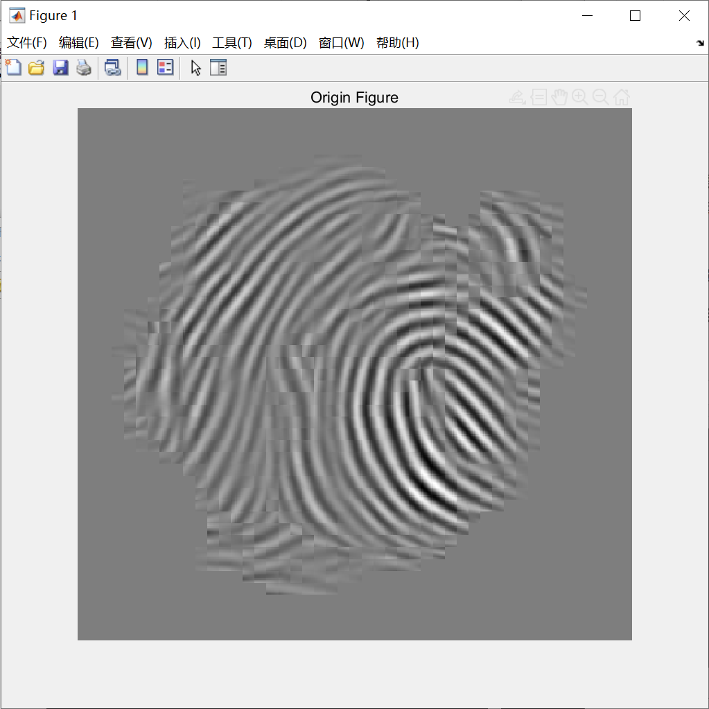
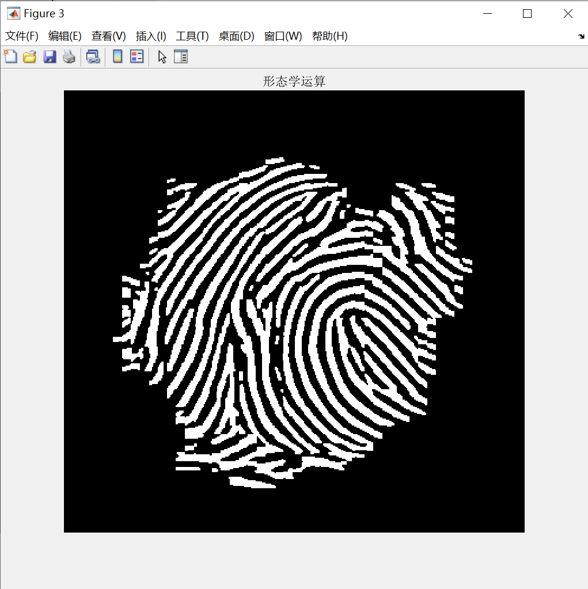
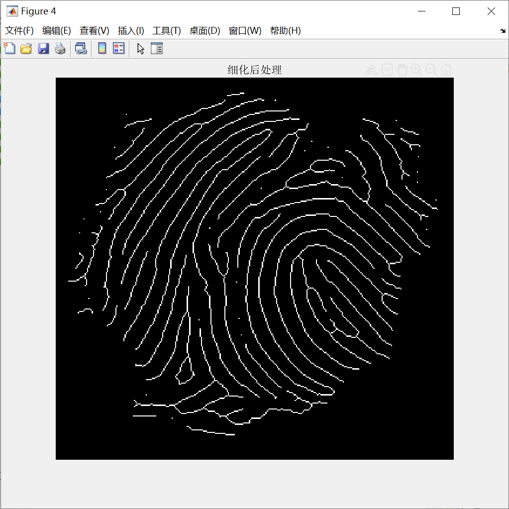
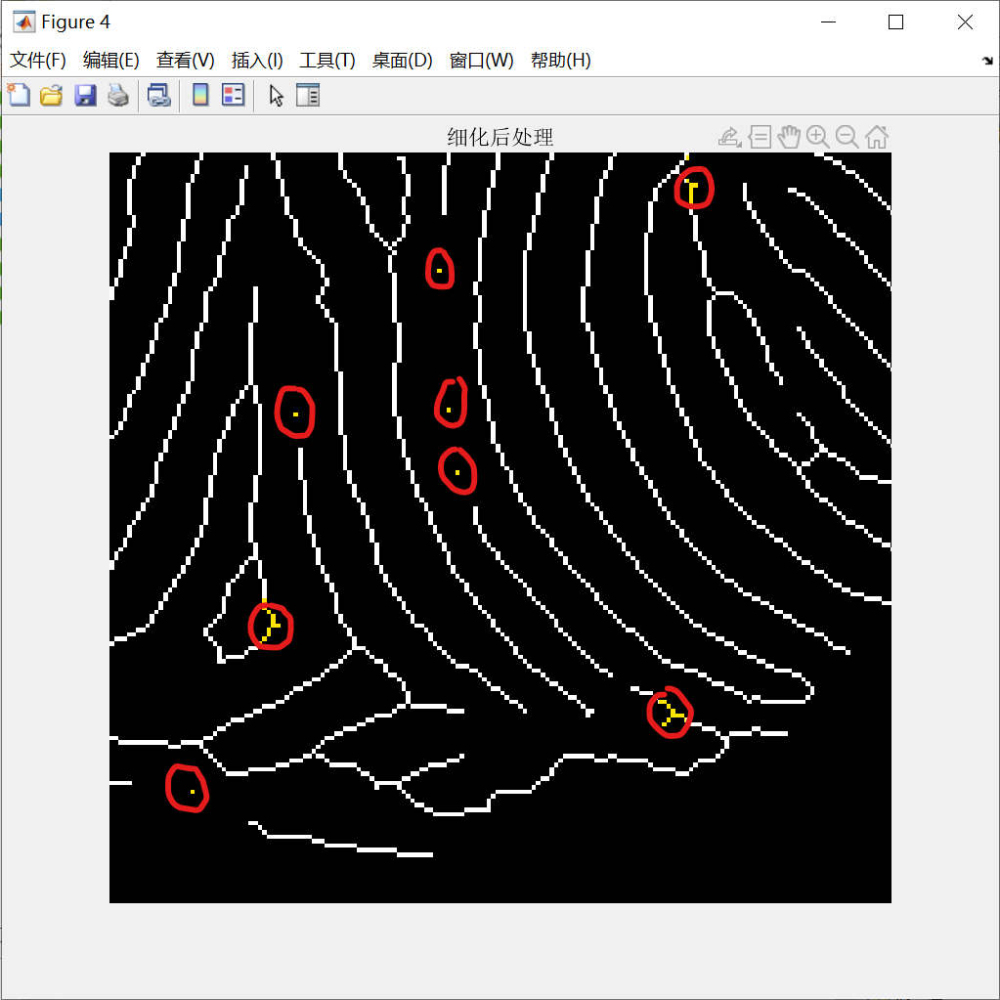
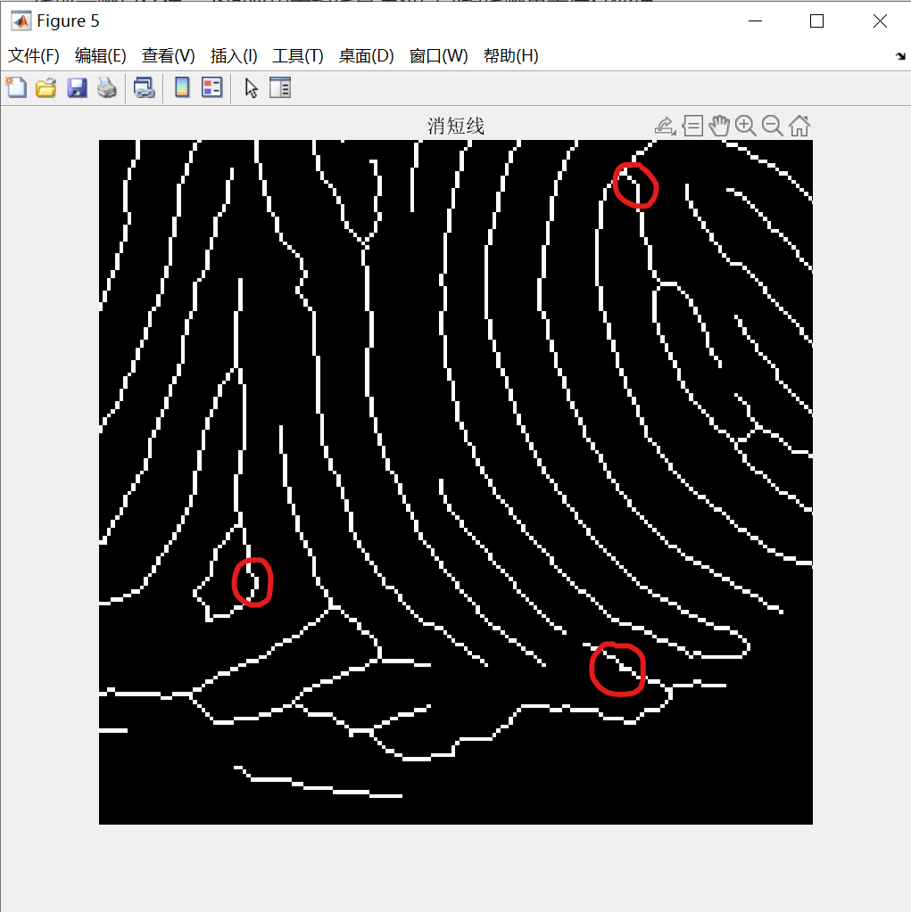
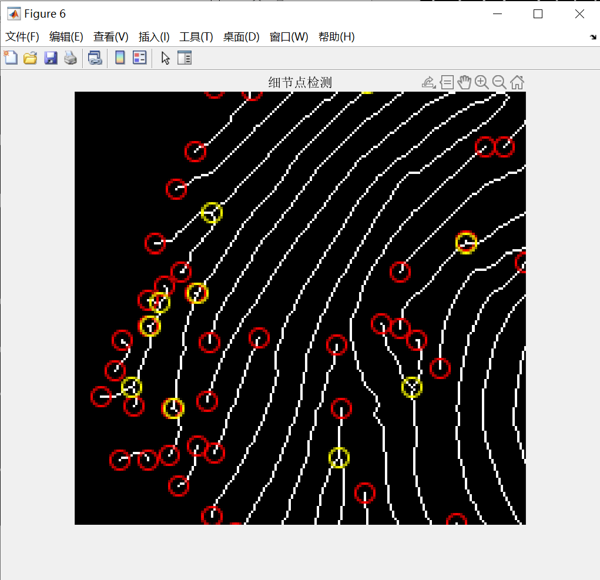
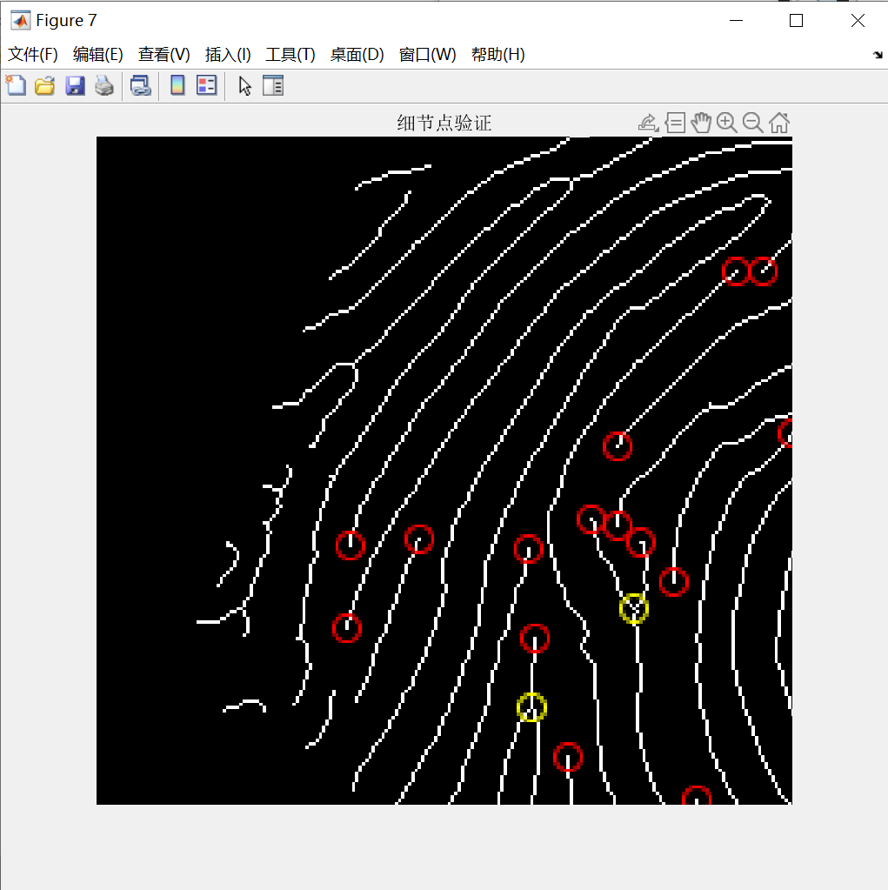

<h2  align = "center" >数字图像处理<br>第五次小作业报告 </h2>

<h6 align = "center">自96 曲世远 2019011455</h6>

### Problem1

#### **1.算法要点与理论原理**

我认为本次作业第一题主要有以下几个要点：

1. 脊线分割
1. 脊线细化及后处理
1. 细节点的检测与验证

针对以上我认为以及实现过程中遇到的算法要点，我才用了以下的算法原理加以解决：

1. 脊线分割部分利用形态学运算对缩放后的二值化图像的缺陷进行修整；
1. 对脊线细化后应用老师课上讲到的方法并结合细节点进行处理
1. 通过判断交会线的数量判断细节点，同时通过综合信息验证是否为伪细节点

> 更多处理图像在文件夹目录中，或是运行作业.m文件，通过修改参数`id`可以对不同的图像进行运算，以便查看中间过程输出，本报告中仅包含解释算法或表明效果的部分截图
>

#### 2.算法具体实现

```matlab
%% Part1 脊线分割
% 二值化
img = Binarize(img, threshold(id));
%figure, imshow(img), title('二值化')
% 形态学运算
img = imresize(img, 4, 'nearest');
se1 = strel('disk', disk(id));
se2 = [0, 1, 0; 1, 1, 1; 0, 1, 0];
img = imopen(img, se1);
img = imdilate(img, se2);
imclose(img, se1);
img = imresize(img, 0.25, 'bilinear');
img = im2double(img);
img = Binarize(img, threshold(id));
img = ~bwareaopen(~img, 8, 4);
figure, imshow(img), title('形态学运算')
```

本段代码通过进行二值化与形态学运算处理给定的指纹图像，为了提高形态学处理的精度，我使用了将原图放大后在进行形态学运算的方式。这样既可以获得更高的精度，又可以精确的调节参数处理细节，有助于提升效果。值得一提的是，为了确保转换图像大小不损失精度与较多的指纹信息，我经过分析认为从小到大的方向应当使用最近邻以便保全指纹图像的二值信息，避免过多插值导致模糊；而从大到小的方向由于进行了运算处理，应当使用精度更高的二次线性插值进行缩小。

```matlab
%% Part2 脊线细化
% 形态学细化
img = bwmorph(img, 'thin', inf);
img = bwskel(img);
%figure, imshow(img), title('脊线细化')
% 细化后处理
cnt = 0;
x1 = img;
while(cnt < epoch(id))
    x1 = x1 - (horm(x1, B(:, :, 1), ~B(:, :, 1)));
    x1 = x1 - (horm(x1, B(:, :, 2), ~B(: ,: ,2)));
    x1 = x1 - (horm(x1, B(: ,: ,3), ~B(: ,: ,3)));
    x1 = x1 - (horm(x1, B(: ,:, 4), ~B(: ,:, 4)));
    x1 = x1 - (horm(x1, B(:, :, 5), ~B(: ,: ,5)));
    x1 = x1 - (horm(x1, B(: ,: ,6), ~B(: ,: ,6)));
    x1 = x1 - (horm(x1, B(: ,:, 7), ~B(: ,: ,7)));
    x1 = x1 - (horm(x1, B(: ,: ,8), ~B(: ,:, 8)));
    cnt = cnt + 1;
end
cnt = 0;
x2 = horm(x1, B(: , :, 1), ~B(: ,: ,1)) | ...
    horm(x1, B(: ,:, 2), ~B(:, :, 2)) | ...
    horm(x1, B(: ,:, 3), ~B(:, :, 3)) | ...
    horm(x1, B(: ,:, 4), ~B(:, :, 4)) | ...
    horm(x1, B(:, :, 5), ~B(:, :, 5)) | ...
    horm(x1, B(:, :, 6), ~B(:, :, 6)) | ...
    horm(x1, B(:, :, 7), ~B(:, :, 7)) | ...
    horm(x1, B(: ,:, 8), ~B(:, :, 8));
x3 = imdilate(x2, strel('square', 3));
while(cnt < epoch(id))
    x3 = imdilate(x3, strel('square', 3)) & img;
    cnt = cnt + 1;
end
img = x1 | x3;

figure, imshow(img), title('细化后处理')
% 消短线
img = bwareaopen(img, 4, 8);
[M, N] = size(img);
hit = img;
for i = 1: l(id) % 消减长度维l
    temp = hit;
    for j = 1: size(E)
        e = E(:, :, 1);
        e = squeeze(e);
        p = bwhitmiss(hit, e);
        temp = bitand(temp, (1 - p));
    end
    hit = temp;
end
%figure, imshow(hit), title('消短线-修剪')

ends = bwmorph(hit, 'endpoints', inf);
se = strel('square', 3);
dilate = imdilate(ends, se);
for i = 1: l(id) - 1
    dilate = bitand(dilate, img);
    dilate = imdilate(dilate, se);
end
dilate = bitand(dilate, img);
img = bitor(dilate, hit);
%figure, imshow(img), title('消短线-膨胀')
% 分叉点消短线
branches = zeros(0, 2); % 分叉点
for i = 2: M - 1
    for j = 2 : N - 1
        if img(i, j) == 1
            x1 = i - 1;
            x2 = i + 1;
            y1 = j - 1;
            y2 = j + 1;
            br = (abs(img(x1, j) - img(x1, y1)) + ...
                abs(img(x1, y2) - img(x1, j)) + ...
                abs(img(i, y2) - img(x1, y2)) + ...
                abs(img(x2, y2) - img(i, y2)) + ...
                abs(img(x2, j) - img(x2, y2)) + ...
                abs(img(x2, y1) - img(x2, j)) + ...
                abs(img(i, y1) - img(x2, y1)) + ...
                abs(img(x1, y1) - img(i, y1))) / 2;
            if br == 3
                branches = [branches; i j]; %#ok<AGROW> 
            end
        end
    end
end

%% 结合分叉点去短线
for i = 1 : size(branches)
    img(branches(i, 1), branches(i, 2)) = 0;
end
img = bwareaopen(img, 4, 8);
for i = 1 : size(branches)
    img(branches(i, 1), branches(i, 2)) = 1;
end
img = bwareaopen(img, 4, 8);
figure, imshow(img), title('消短线')
```

本段代码主要实现的功能是进行指纹图形的细化以及细化后的处理以及消除短线等情况。除了老师课上讲到的细化后处理方式以及收缩膨胀的消短线方式，我还附加了针对分叉点处的特殊处理：即可以通过先将细节点置零，在进行形态学连通开运算，以消去较小的非连通分量，这样，通过伪分叉点出发的短线就可以被完美的去除，之后恢复分叉点后再进行一次连通开运算就可以将伪分叉点去除。经过实际比较，确实可以通过此方法消除掉很多分叉点处的短细线。

```matlab
%% 细节点检测
ends = zeros(0, 2); % 端点
branches = zeros(0, 2); % 分叉点
for i = 2: M - 1
    for j = 2 : N - 1
        if img(i, j) == 1
            x1 = i - 1;
            x2 = i + 1;
            y1 = j - 1;
            y2 = j + 1;
            br = (abs(img(x1, j) - img(x1, y1)) + ...
                abs(img(x1, y2) - img(x1, j)) + ...
                abs(img(i, y2) - img(x1, y2)) + ...
                abs(img(x2, y2) - img(i, y2)) + ...
                abs(img(x2, j) - img(x2, y2)) + ...
                abs(img(x2, y1) - img(x2, j)) + ...
                abs(img(i, y1) - img(x2, y1)) + ...
                abs(img(x1, y1) - img(i, y1))) / 2;
            if br == 1
                ends = [ends; i j]; %#ok<AGROW> 
            end
            if br == 3
                branches = [branches; i j]; %#ok<AGROW> 
            end
        end
    end
end
img = im2double(img);
fulimg = img;
for i = 1: size(ends)
    fulimg = insertShape(fulimg, 'circle', [ends(i, 2), ends(i, 1), 4], 'LineWidth', 1, 'Color', 'red');
end
for i = 1: size(branches)
    fulimg =  insertShape(fulimg, 'circle', [branches(i, 2), branches(i, 1), 4], 'LineWidth', 1, 'Color', 'yellow');
end
figure, imshow(fulimg), title('细节点检测')

%% 细节点验证
% 端点
for i = 1: size(ends)
    flag = 1;
    x0 = ends(i, 1) - 3;
    x1 = ends(i, 1) + 3;
    y0 = ends(i, 2) - 3;
    y1 = ends(i, 2) + 3;
    % 删去边缘点
    if sum(sum(mask(x0 : x1, y0 : y1))) < 40
        flag = 0;
    end
    % 删去断线端点
    [idx, ~] = find(abs(ends(:, 1) - ends(i, 1)) <= 6);
    [idy, ~] = find(abs(ends(:, 2) - ends(i, 2)) <= 6);
    if sum(intersect(idx, idy)) - i > 0
        flag = 0;
    end
    % 删去假端点
    for x = x0 : x1
        for y = y0 : y1
            [idx, ~] = find(branches(:, 1) == x);
            if branches(idx, 2) == y
                flag = 0;
                break
            end
        end
    end
    if flag
        img = insertShape(img, 'circle', [ends(i, 2), ends(i, 1), 4], 'LineWidth', 1, 'Color', 'red');
    end
end
% 分叉点
for i = 1 : size(branches)
    flag = 1;
    x0 = branches(i, 1) - 3;
    x1 = branches(i, 1) + 3;
    y0 = branches(i, 2) - 3;
    y1 = branches(i, 2) + 3;
    % 删去边缘点
    if sum(sum(mask(x0 : x1, y0 : y1))) < 40
        flag = 0;
    end
    % 删去假分叉点
    for x = x0 : x1
        for y = y0 : y1
            [idx, ~] = find(ends(:, 1) == x);
            for j = 1 : size(idx)
                if ends(idx(j), 2) == y
                    flag = 0
                    break
                end
            end
%             if ends(idx, 2) == y
%                 flag = 0;
%                 break
%             end
        end
    end
    if flag
        img = insertShape(img, 'circle', [branches(i, 2), branches(i, 1), 4], 'LineWidth', 1, 'Color', 'yellow');
    end
end
figure, imshow(img), title('细节点验证')
```

本段代码主要是针对细节点的检测与验证算法，通过老师课上给出的细节点检测公式可以得到全部的端点与分叉点，之后通过排除掉指纹图形边缘的点，在排除掉假的点从而得到验证后的结果。

#### 3.实验结果与分析

**分析二值化与形态学运算结果**



可以看到，经过形态学运算，原指纹图形较好的变为了二值化图像，但由于原图的分辨率有限，有部分色块会导致指纹脊线断开或是出现异常，已经通过算法尽力的减小异常，剩余的部分交由后续处理手段处理。

**脊线细化与细化后处理**



在进行指纹细化及细化后处理后，整体的脊线脉络很清晰的呈现出来，不过仍有一些局部短线或是噪点存在，下面应用去短线算法对局部短线噪声等进行处理：



可以看到，途中通过黄颜色红圈标注出的细节处均有短线或是噪点存在，应用上文提到的针对短线进行综合处理的算法后，可以得到如下图所示的结果：



可以发现，图中标注的的噪点与短线已经被全部消除了，并且消除后的指纹脊线十分平和顺滑。这里需要提到的是，针对这几种短线，需要综合运用我上文提到的两周思路才能完全消除，仅应用缩短后膨胀的方式有些处会被回复回来，但利用了分叉点的信息后，就可以得到很理想的结果了。

**细节点检测与验证**

直接运用老师上课讲到的细节点检测算法会导致检测出很多无效的细节点，诸如下图所示：



很显然图中有大量指纹边缘导致的非细节点，与指纹脊线弯折导致的假细节点，尤其是线上的细小突起被识别为分叉点与端点，为了消除这些无效的细节点，我通过分类判断，依次消除掉图形边缘的细节点（通过点周围有效面积结合指纹图像的mask图进行判断），分叉点与端点过近的无效点。经过上述算法的处理后，可以得到下图所示的局部细节点：



可以看到，上述算法不仅很好的消除了边缘的非细节点，也很好地处理了由于脊线弯折与波动带来的假细节点。

#### 4.收获

本次作业让我对形态学运算的灵活使用有了全新的理解，尤其是开闭等基础的形态学运算经过灵活使用后，可以起到巨大的作用。也使得我对处理二值指纹图像有了一定的经验和体会。

#### 5.可能的改进方向

我认为我本次作业的完成质量还是比较可观的，有以下几个方面由于时间与能力的不足，我认为后续还可以加以提高：

1. 可以针对不同色块实现更加准确的二值处理，以解决由于原图像色块之间灰度差异的问题，从而得到更加平滑连续的二值化图像，便于后续处理。


###### 
